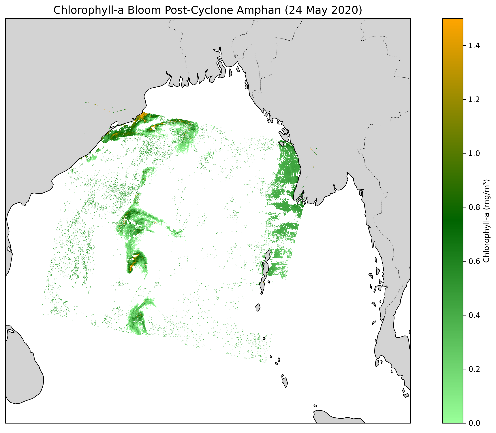

# Cyclone Amphan (2020) - Bay of Bengal Analysis

This project presents a remote sensing analysis of Cyclone Amphan (May 2020) and post Phytoplankton blooms using satellite data.

## Overview

Cyclone Amphan was a powerful tropical cyclone in the Bay of Bengal in May 2020. This project visualizes its track and analyzes ocean response using satellite-derived variables.

## Cyclone Track Visualization

## Methods

- Cyclone track data obtained from NOAA
- Python used for visualization and analysis

## Files

- `amphantrack2.ipynb` → cyclone track analysis notebook
- `cyclone_track.png` → visualization output

---

## Sea Surface Temperature (SST) Anomalies

This section analyzes Sea Surface Temperature (SST) anomalies before, during, and after Cyclone Amphan using CMEMS satellite-derived data.

### Data Source

- CMEMS (Copernicus Marine Environment Monitoring Service)  
- Product: `METOFFICE-GLO-SST-L4-REP-OBS-SST`  
- File used: `METOFFICE-GLO-SST-L4-REP-OBS-SST_1750412263472.nc`

### Analysis

- SST anomaly maps were generated to observe temperature variations  
- Comparison includes:
  - Before cyclone  
  - During cyclone  
  - After cyclone  

### Files

- `SST_Anomaly.ipynb` → SST analysis notebook  
- `SST_Anomaly.png` → SST anomaly visualization

- ---

## Chlorophyll Analysis

This section shows the spatial distribution of chlorophyll concentration during Cyclone Amphan using Sentinel-3 OLCI data.

### Data Source

- Sentinel-3 OLCI Level-2 product from EUMETSAT  
- File used: `S3B_OL_2_WFR____20200524T040216_20200524T040516_20210617T213340_0179_039_161______MAR_R_NT_003.SEN3`

### Files

- `Chlorophyll_map.ipynb` → chlorophyll analysis notebook
- `Chlorophyll_map.png` → visualization output
